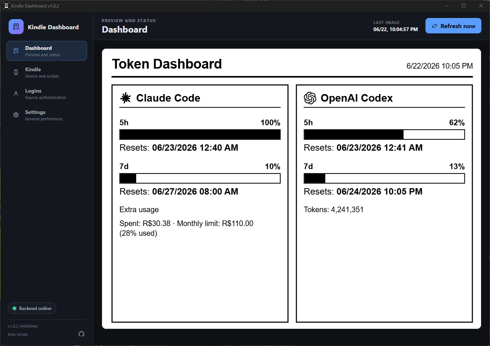
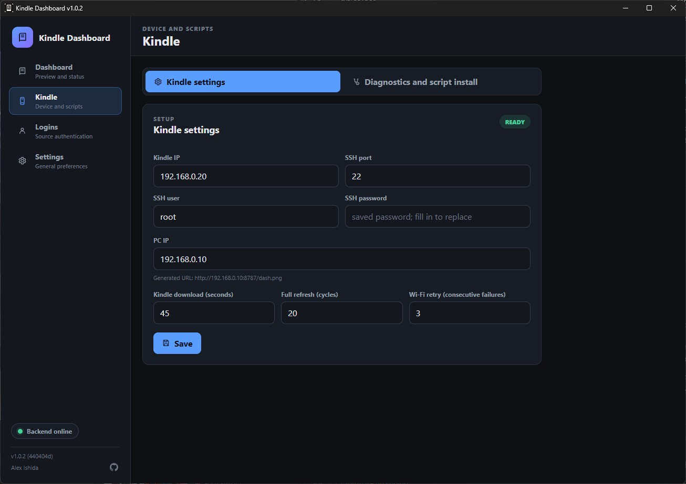
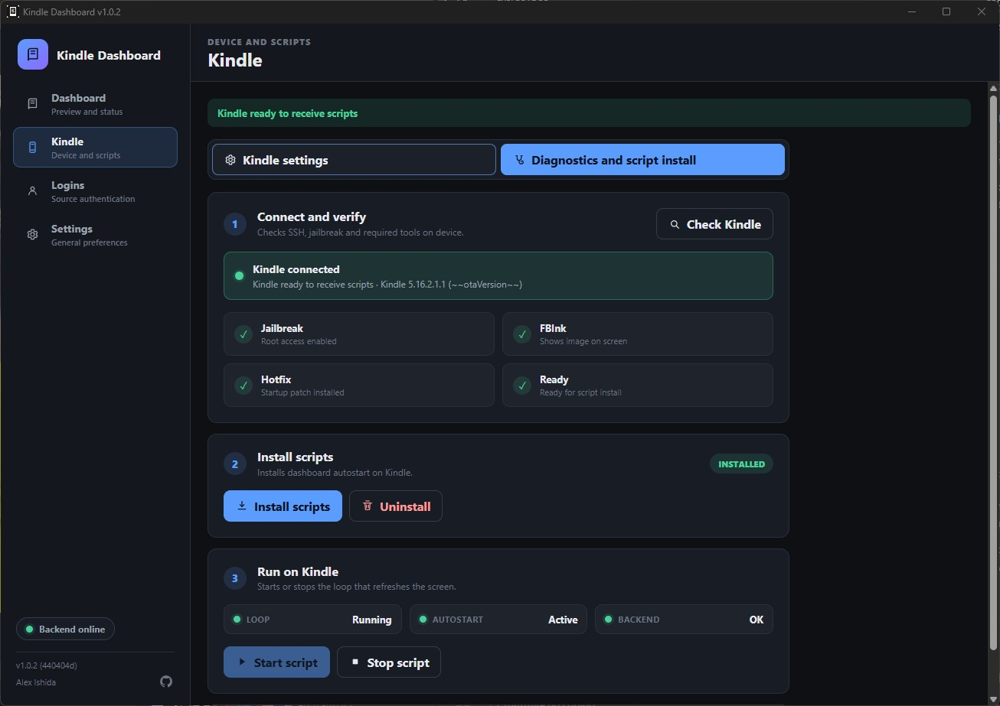
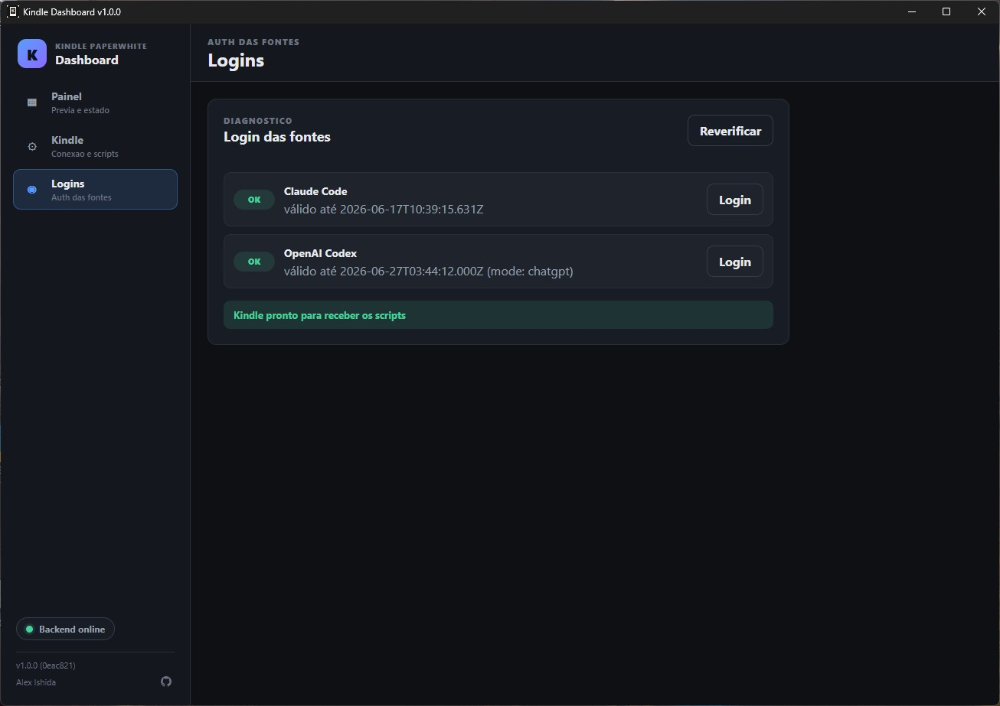
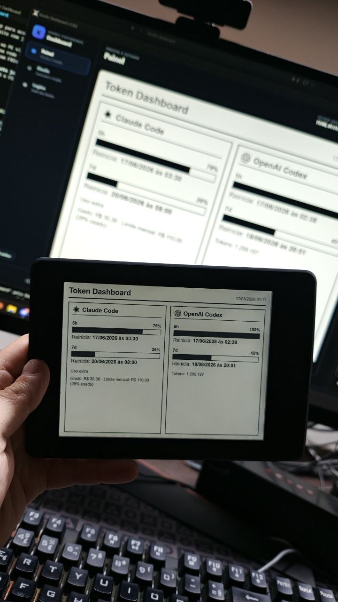

# Kindle Dashboard

Dashboard desktop para acompanhar uso de ferramentas de IA e exibir a imagem em
um Kindle Paperwhite com jailbreak.

O aplicativo roda no PC via Electron, coleta dados locais, renderiza um PNG e
serve essa imagem na rede local. O Kindle apenas baixa o PNG periodicamente e
o desenha na tela com FBInk.

O projeto **nao executa jailbreak**. Ele assume que o Kindle ja esta
desbloqueado, com SSH e FBInk disponiveis.

---

## Screenshots

| Painel | Configuracao Kindle |
|---|---|
|  |  |
| **Diagnostico e Instalacao** | **Logins** |
|  |  |
| **Exemplo** |
|  |

---

## Guia de Uso

### 1. Requisitos

No Kindle:

- Kindle Paperwhite com jailbreak feito (ex.: WinterBreak).
- SSH habilitado e acessivel pela rede local.
- FBInk instalado.
- Kindle e PC na mesma rede Wi-Fi.

No PC (Windows):

- Windows 10/11.
- Opcional: Claude Code e/ou Codex instalados, se quiser que o dashboard
  mostre o uso dessas ferramentas.

### 2. Instalar o app no PC

Baixe o instalador `.exe` (gerado via `npm run build:win`, veja
[Informacoes para Desenvolvimento](#informacoes-para-desenvolvimento)) e
execute-o normalmente, como qualquer outro programa do Windows.

Depois de instalado, abra o "Kindle Dashboard" pelo Menu Iniciar. Nas
proximas vezes, se a configuracao ja estiver completa, o app inicia direto em
segundo plano e fica disponivel no tray do Windows (icone perto do relogio).

### 3. Configurar o Kindle pelo app

Na primeira abertura, o app mostra a aba **Kindle > Configuracao**. Preencha:

| Campo | O que colocar |
| --- | --- |
| IP do Kindle | Endereco IP do Kindle na rede local |
| Porta SSH | Normalmente `22` |
| Usuario SSH | Geralmente `root` |
| Senha SSH | Senha de acesso SSH do Kindle |
| IP do PC | IP do seu PC na mesma rede; o app monta a URL do PNG automaticamente (`http://<IP_DO_PC>:8787/dash.png`) |
| Download Kindle (segundos) | Intervalo entre downloads do PNG no Kindle |
| Refresh completo (ciclos) | A cada quantos downloads o Kindle faz um refresh completo de tela |
| Retry Wi-Fi (falhas seguidas) | Apos quantas falhas seguidas o Kindle tenta reconectar o Wi-Fi |

Depois de clicar em **Salvar**:

1. Abra a aba **Kindle > Diagnostico e Instalacao de Scripts**.
2. Clique em **Verificar Kindle** e confirme que SSH, jailbreak, FBInk e
   demais checagens aparecem como OK.
3. Clique em **Instalar scripts**. Isso copia os scripts de autostart para o
   Kindle e registra o job de boot.
4. Vá em **Logins** e resolva pendencias de login do Claude Code/Codex, se o
   diagnostico pedir.

Com os scripts instalados, o Kindle passa a baixar e exibir o PNG sozinho,
mesmo depois de reiniciar.

### 4. Uso no dia a dia

- O painel principal (**Painel**) mostra a pre-visualizacao da imagem atual e
  um botao **Atualizar agora** para forcar um novo render.
- Em **Kindle > Diagnostico**, use **Iniciar script** e **Parar script** para
  controlar o loop no aparelho sem remover o autostart.
- O app fica no tray do Windows. Clique no icone para reabrir a janela; o
  menu do tray tem **Abrir configuracoes** e **Encerrar**.
- Para o app iniciar automaticamente com o Windows, use os scripts de
  autostart do Windows (veja [Scripts NPM](#scripts-npm) abaixo).

### 5. Desinstalar / remover

Para remover o autostart do Kindle, use o botao **Desinstalar Script** na aba
**Kindle > Diagnostico e Instalacao de Scripts**, ou veja o passo a passo
manual em [KINDLE-INSTALACAO.md](KINDLE-INSTALACAO.md).

### Privacidade

Nao commitar:

- Serial do Kindle.
- IP real do PC ou Kindle.
- Senha SSH.
- Tokens, cookies, bancos locais ou arquivos de sessao.
- `out/dash.png`, logs, builds, instaladores e configs locais.
- Arquivos `.env` ou `config.json` do Electron.

Dados sensiveis ficam fora do renderer. A senha SSH salva pelo app fica no
diretorio `userData` do Electron e usa `safeStorage` quando disponivel.

---

## Informacoes para Desenvolvimento

### Estado Atual

- Aplicativo Electron + React + TypeScript integrado com `electron-vite`.
- Backend Node embutido no processo principal do Electron.
- Render atomico do PNG em `out/dash.png` no modo dev.
- Tray do Windows com acoes para abrir configuracoes e encerrar.
- Fluxo de primeira execucao com configuracao do Kindle por SSH.
- Verificacao local de login para Claude Code e Codex.
- Instalador de scripts no Kindle via SSH, sem SFTP.

### Configuracao

Toda configuracao operacional do produto fica na UI do Electron, em especial:

- URL do dashboard
- IP, porta, usuario e senha SSH do Kindle
- intervalo de download
- full refresh
- tentativa de recuperacao de Wi-Fi

O app salva esses dados no `userData` local. Nao use `.env` para configurar o
fluxo normal do produto.

### Scripts NPM

```powershell
npm run dev               # abre o app Electron em desenvolvimento
npm run build              # typecheck + build Electron
npm run build:win          # gera instalador Windows
npm run typecheck          # valida TypeScript
npm test                   # roda testes Node
npm run backend            # backend legado independente
npm run supervisor         # fallback legado com Chrome instalado
npm run autostart:install  # registra o app para iniciar com o Windows
npm run autostart:status   # consulta o status do autostart do Windows
npm run autostart:stop     # para o autostart do Windows
npm run autostart:uninstall # remove o autostart do Windows
```

Comandos relacionados ao Kindle (instalar/remover scripts, verificar status)
devem ser feitos pela UI do Electron. Detalhes do que cada script remoto faz:
[KINDLE-INSTALACAO.md](KINDLE-INSTALACAO.md).

### Estrutura

```text
backend/       API local, coletores e preflight de auth
build/         icones do app
kindle/        scripts que rodam no Kindle
render/        HTML usado para gerar o PNG
scripts/       helpers Node/PowerShell
src/main/      processo principal Electron
src/preload/   ponte segura via contextBridge
src/renderer/  UI React
src/shared/    tipos compartilhados
test/          testes Node
```

### Gerar o Instalador Windows (.exe)

O instalador e gerado com `electron-builder` no formato NSIS.

```powershell
npm run build:win
```

O que acontece:

1. **`npm run typecheck`** — valida o TypeScript.
2. **`electron-vite build`** — compila main, preload e renderer para `dist/`.
3. **`electron-builder --win`** — empacota o app + dependencias num instalador `.exe` na pasta `release/`.

**Pre-requisitos:**

- Node.js >= 24 e dependencias instaladas (`npm install`).
- Icone do app em `build/icon.png` (ja incluso no repositorio).
- Windows 10/11 (o cross-build a partir de Linux/Mac nao e suportado por este projeto).

O instalador gerado estara em `release/Kindle-Dashboard-<versao>-setup.exe`.

### Validacao Recomendada

```powershell
npm test
npm run typecheck
```

Use `npm run build` antes de gerar instalador ou publicar uma versao.

### Changelog

- Historico de mudancas: [CHANGELOG.md](CHANGELOG.md)
- Releases publicas: [GitHub Releases](https://github.com/alexishida/kindle-dashboard/releases)
